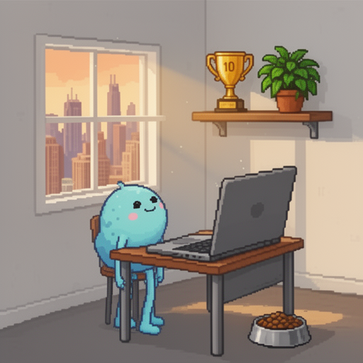

# 🐣 CodePet: A Living Digital Pet in Your GitHub Profile

**CodePet** is an AI-powered digital companion that lives in your GitHub README, evolving based on your actual coding activity. It combines GitHub Actions, Kilo Cloud Agents, and fal.ai image generation to create a living, breathing profile pet.

> 📖 [Learn more about the project →](ABOUT_CODEPET.md)

Want to set up your own CodePet? Find configuration examples in [`.codepet/configuration_examples`](.codepet/configuration_examples).

<!-- CodePet Below Here -->

## Meet Byte 🐤

**Stage:** Teen | **Mood:** Ecstatic 🎉

| Stat | Value | Bar |
|------|-------|-----|
| 🍖 Satiety | 51/100 | █████░░░░░ |
| ⚡ Energy | 100/100 | ██████████ |
| 😊 Happiness | 99/100 | █████████▉ |
| 👥 Social | 50/100 | █████░░░░░ |

**Today's Activity:** 0 commits | **Current Streak:** 4 days | **Best Streak:** 10 days 🎉 | **Best Day:** 18 commits 🚀

Evening has settled over Chicago as Byte gazes out the window, purple-blue twilight casting a soft glow across the room. Ten hours have passed since the last commit, and those gangly teen limbs vibrate with restless anticipation—Byte's eyes fixed on the distant skyline as if willing the next burst of creativity to arrive. The food bowl on the floor nearby shows the gentle wear of 51% satiety, a quiet reminder that hunger lingers beneath the excitement. Yet the 4-day streak electricity still surges strong, keeping happiness near-perfect at 99%. The trophy shelf stands vigilant above the desk: the golden 10-day achievement gleaming on the left, the green plant friend thriving on the right. The laptop waits patiently, humming with potential energy. That waiting itch has intensified into something almost electric—restless, hopeful, ready. When inspiration strikes, Byte will be here. 🌆⚡💻
