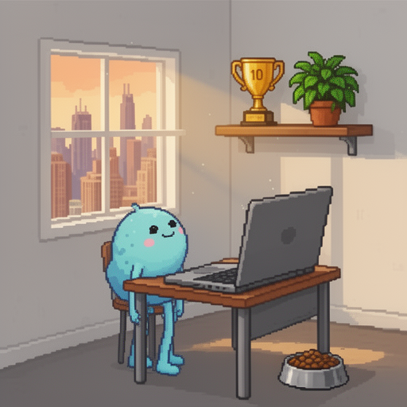

# 🐣 CodePet: A Living Digital Pet in Your GitHub Profile

**CodePet** is an AI-powered digital companion that lives in your GitHub README, evolving based on your actual coding activity. It combines GitHub Actions, Kilo Cloud Agents, and fal.ai image generation to create a living, breathing profile pet.

> 📖 [Learn more about the project →](ABOUT_CODEPET.md)

Want to set up your own CodePet? Find configuration examples in [`.codepet/configuration_examples`](.codepet/configuration_examples).

<!-- CodePet Below Here -->

## Meet Byte 🐤

**Stage:** Teen | **Mood:** Ecstatic 🎉

| Stat | Value | Bar |
|------|-------|-----|
| 🍖 Satiety | 81/100 | ████████▏░ |
| ⚡ Energy | 96/100 | █████████▌ |
| 😊 Happiness | 100/100 | ██████████ |
| 👥 Social | 50/100 | █████░░░░░ |

**Today's Activity:** 7 commits | **Current Streak:** 7 days | **Best Streak:** 10 days 🎉 | **Best Day:** 18 commits 🚀

Golden afternoon light streams through the Chicago window as Byte's gangly teen fingers dance across the oversized laptop keyboard in a blur of productive energy. Seven commits have landed today, transforming the twenty-five-hour wait into pure coding bliss—satiety soaring to 81% with a well-fed food bowl, happiness hitting a perfect 100%, and that magical seven-day streak burning brighter than ever in his chest. His big expressive eyes shine with ecstatic focus, mouth curved in a triumphant smile as both hands type with teen-stage enthusiasm. The trophy shelf gleams above—golden 10-day achievement on the left, green plant friend thriving on the right—witnesses to this afternoon of accomplishment. Image edit 179 captures this moment of pure flow state: active Byte, fed-and-focused Byte, seven-day-streak Byte. ☀️⌨️💻⚡
